# CRM Database - Entity Relationship Diagram (Updated)

## Mermaid ERD

```mermaid
erDiagram
    users {
        int id PK
        string email "Unique - Used for login"
        string first_name "Required"
        string last_name "Required"
        string password
        string role "Enum: ADMIN, USER"
        bool is_staff
        bool is_active
        int version "For optimistic locking"
        datetime last_login
        datetime date_joined
        datetime created_at
        datetime updated_at
    }

    accounts {
        int id PK
        string name "Required, Unique"
        string phone
        string website
        string type "Enum: prospect, customer, partner, competitor"
        text description
        text billing_address
        text shipping_address
        int parent_account_id FK "Self-referencing"
        int owner_id FK "Required"
        bool is_active "Default: True"
        int version "For optimistic locking"
        datetime created_at
        datetime updated_at
    }

    contacts {
        int id PK
        string first_name
        string last_name "Required"
        string title
        string email
        string phone
        text description
        int reports_to_id FK "Self-referencing"
        int account_id FK "Required"
        int owner_id FK "Required"
        bool is_active "Default: True"
        int version "For optimistic locking"
        datetime created_at
        datetime updated_at
    }

    leads {
        int id PK
        string first_name
        string last_name "Required"
        string company "Required"
        string title
        string email
        string phone
        string website
        text billing_address
        text shipping_address
        string status "Enum: New, Contacted, Qualified, Converted"
        string lead_source "Enum: Website, Referral, Partner, Cold Call, Other"
        string industry
        int owner_id FK "Required"
        bool is_active "Default: True"
        int version "For optimistic locking"
        datetime created_at
        datetime updated_at
    }

    opportunities {
        int id PK
        string name "Required"
        string stage "Enum: qualification, meet_present, proposal, negotiation, closed_won, closed_lost"
        date close_date
        text next_step
        text description
        int account_id FK "Required"
        int owner_id FK "Required"
        bool is_active "Default: True"
        int version "For optimistic locking"
        datetime created_at
        datetime updated_at
    }

    products {
        int id PK
        string name "Required"
        text description
        decimal standard_list_price "Default: 0.00"
        bool is_retainer_product "Default: False"
        int owner_id FK "Required"
        bool is_active "Default: True"
        int version "For optimistic locking"
        datetime created_at
        datetime updated_at
    }

    contracts {
        int id PK
        string status "Enum: Draft, Active, Expired, Terminated, Cancelled"
        date start_date "Required"
        date end_date "Required"
        string billing_cycle "Enum: Monthly, Annually"
        int account_id FK "Required"
        int opportunity_id FK "Nullable - Source opportunity"
        int owner_id FK "Nullable"
        int version "For optimistic locking"
        datetime created_at
        datetime updated_at
    }

    orders {
        int id PK
        date order_date "Auto-generated"
        string status "Enum: Pending Fulfillment, Shipped, Delivered, Completed, Cancelled"
        int account_id FK "Required"
        int opportunity_id FK "Nullable - Source opportunity"
        int owner_id FK "Nullable"
        int version "For optimistic locking"
        datetime created_at
        datetime updated_at
    }

    invoices {
        int id PK
        string invoice_number "Unique, Required"
        date issue_date "Required"
        date due_date "Required"
        decimal balance_due "Amount still owed"
        string status "Enum: Awaiting Payment, Partially Paid, Paid in Full, Fulfilled, Cancelled"
        int account_id FK "Nullable"
        int order_id FK "Nullable"
        int contract_id FK "Nullable"
        text notes
        bool is_active "Default: True"
        int version "For optimistic locking"
        datetime created_at
        datetime updated_at
    }

    invoice_line_items {
        int id PK
        int invoice_id FK "Required"
        int product_id FK "Required"
        int quantity "Required, Positive"
        decimal unit_price "Required"
        bool is_active "Default: True"
        int version "For optimistic locking"
        datetime created_at
        datetime updated_at
    }

    payments {
        int id PK
        decimal amount "Required"
        date payment_date "Required"
        string payment_method "Enum: CREDIT_CARD, CASH, CHECK, WIRE, OTHER"
        string status "Enum: COMPLETED, FAILED, PENDING"
        string transaction_id
        text notes
        int invoice_id FK "Required"
        int account_id FK "Required"
        int version "For optimistic locking"
        datetime created_at
        datetime updated_at
    }

    activities {
        int id PK
        string type "Enum: Task, Event"
        string subject "Required"
        text description
        string status "Enum: Not Started, In Progress, Completed, Waiting on someone else, Deferred"
        string priority "Enum: High, Normal, Low"
        date due_date "For Tasks"
        datetime start_time "For Events"
        datetime end_time "For Events"
        bool is_all_day_event "Default: False"
        string location "For Events"
        int assigned_to_id FK "Required - Organizer/Owner"
        int account_id FK "Nullable - What (at most one)"
        int opportunity_id FK "Nullable - What (at most one)"
        int contract_id FK "Nullable - What (at most one)"
        int order_id FK "Nullable - What (at most one)"
        int invoice_id FK "Nullable - What (at most one)"
        int version "For optimistic locking"
        datetime created_at
        datetime updated_at
    }

    activity_contacts {
        int id PK
        int activity_id FK "Required"
        int contact_id FK "Required"
    }

    activity_leads {
        int id PK
        int activity_id FK "Required"
        int lead_id FK "Required"
    }

    activity_attendees {
        int id PK
        int activity_id FK "Required"
        int user_id FK "Required"
    }

    opportunity_line_items {
        int id PK
        int opportunity_id FK "Required"
        int product_id FK "Required"
        int quantity "Required, Positive, Default: 1"
        decimal sale_price "Required"
        bool is_active "Default: True"
        int version "For optimistic locking"
        datetime created_at
        datetime updated_at
    }

    order_line_items {
        int id PK
        int order_id FK "Required"
        int product_id FK "Required"
        int quantity "Required, Positive"
        decimal price_at_purchase "Required"
        datetime created_at
        datetime updated_at
    }

    contract_line_items {
        int id PK
        int contract_id FK "Required"
        int product_id FK "Required"
        int quantity "Required, Positive"
        decimal price_per_cycle "Required"
        datetime created_at
        datetime updated_at
    }

    opportunity_contact_roles {
        int id PK
        int opportunity_id FK "Required"
        int contact_id FK "Required"
        string role
        datetime created_at
        datetime updated_at
    }

    %% --- User Relationships ---
    users ||--o{ accounts : "owns"
    users ||--o{ contacts : "owns"
    users ||--o{ leads : "owns"
    users ||--o{ opportunities : "owns"
    users ||--o{ products : "owns"
    users ||--o{ contracts : "owns (nullable)"
    users ||--o{ orders : "owns (nullable)"
    users ||--o{ activities : "assigned_to (organizer)"
    users ||--o{ activity_attendees : "attends"

    %% --- Account Relationships ---
    accounts ||--o{ contacts : "has"
    accounts ||--o{ opportunities : "has"
    accounts ||--o{ orders : "places"
    accounts ||--o{ contracts : "holds"
    accounts ||--o{ invoices : "billed to (nullable)"
    accounts ||--o{ payments : "makes"
    accounts }o--|| accounts : "parent account"

    %% --- Contact Relationships ---
    contacts }o--|| contacts : "reports to"
    contacts ||--o{ opportunity_contact_roles : "participates in"

    %% --- Opportunity Relationships ---
    opportunities ||--o{ opportunity_line_items : "contains"
    opportunities ||--o{ opportunity_contact_roles : "involves"
    opportunities ||--o{ orders : "generates (nullable)"
    opportunities ||--o{ contracts : "generates (nullable)"

    %% --- Product Relationships ---
    products ||--o{ opportunity_line_items : "is in"
    products ||--o{ order_line_items : "is in"
    products ||--o{ contract_line_items : "is in"
    products ||--o{ invoice_line_items : "is in"

    %% --- Order Relationships ---
    orders ||--o{ order_line_items : "contains"
    orders ||--o{ invoices : "generates (nullable)"

    %% --- Contract Relationships ---
    contracts ||--o{ contract_line_items : "details"
    contracts ||--o{ invoices : "generates (nullable)"

    %% --- Invoice Relationships ---
    invoices ||--o{ invoice_line_items : "contains"
    invoices ||--o{ payments : "is paid by"

    %% --- Activity Relationships (UPDATED) ---
    activities ||--o{ activity_attendees : "has attendees"
    activities ||--o{ activity_contacts : "related to contacts (M2M)"
    activities ||--o{ activity_leads : "related to leads (M2M)"
    
    activity_contacts }o--|| contacts : "links"
    activity_leads }o--|| leads : "links"
    activity_attendees }o--|| users : "links"
    
    accounts ||--o{ activities : "what (optional)"
    opportunities ||--o{ activities : "what (optional)"
    contracts ||--o{ activities : "what (optional)"
    orders ||--o{ activities : "what (optional)"
    invoices ||--o{ activities : "what (optional)"
```



## Key Changes in Activities

### What Changed:

1. **REMOVED Legacy Single Relationships:**
   - ❌ `contact_id` FK (single contact)
   - ❌ `lead_id` FK (single lead)

2. **KEPT Many-to-Many Relationships:**
   - ✅ `activity_contacts` join table (multiple contacts per activity)
   - ✅ `activity_leads` join table (multiple leads per activity)
   - ✅ `activity_attendees` join table (multiple users per event)

3. **"What" Relationships (Unchanged):**
   - Still uses single ForeignKeys with constraint (only ONE can be set)
   - `account_id`, `opportunity_id`, `contract_id`, `order_id`, `invoice_id`

### Relationship Summary:

| Relationship Type | Cardinality | Implementation | Description |
|------------------|-------------|----------------|-------------|
| **assigned_to** | Many-to-One | FK to users | ONE user owns/organizes the activity |
| **"What" (Business)** | Many-to-One | FK (mutually exclusive) | At most ONE business object per activity |
| **"Who" (People)** | Many-to-Many | M2M via join tables | MULTIPLE contacts OR leads per activity |
| **attendees** | Many-to-Many | M2M via join table | MULTIPLE users attending event |

### Database Tables:

```
activities table:
┌────┬─────────┬────────────┬────────────┬─────────────────┐
│ id │ subject │ account_id │ assigned_to│ ... other fields│
├────┼─────────┼────────────┼────────────┼─────────────────┤
│ 1  │ Meeting │ 5          │ 10         │ ...             │
└────┴─────────┴────────────┴────────────┴─────────────────┘

activity_contacts table (M2M join):
┌─────────────┬────────────┐
│ activity_id │ contact_id │
├─────────────┼────────────┤
│ 1           │ 12         │  ← Activity 1 has Contact 12
│ 1           │ 15         │  ← Activity 1 has Contact 15
│ 1           │ 18         │  ← Activity 1 has Contact 18
└─────────────┴────────────┘

activity_leads table (M2M join):
┌─────────────┬──────────┐
│ activity_id │ lead_id  │
├─────────────┼──────────┤
│ 2           │ 7        │  ← Activity 2 has Lead 7
│ 2           │ 9        │  ← Activity 2 has Lead 9
└─────────────┴──────────┘

activity_attendees table (M2M join):
┌─────────────┬─────────┐
│ activity_id │ user_id │
├─────────────┼─────────┤
│ 1           │ 10      │  ← Activity 1 has User 10 attending
│ 1           │ 11      │  ← Activity 1 has User 11 attending
│ 1           │ 12      │  ← Activity 1 has User 12 attending
└─────────────┴─────────┘
```

## Constraints

### Activity "What" Constraint (Unchanged):
Only ONE of these can be set per activity:
- `account_id`
- `opportunity_id`
- `contract_id`
- `order_id`
- `invoice_id`

### Activity "Who" Constraint (REMOVED):
- ❌ Old constraint that prevented mixing single contact/lead is REMOVED
- ✅ New validation: Can't mix contacts AND leads in same activity (via M2M)
- ✅ Can have multiple contacts OR multiple leads, but not both

## Example Activity Relationships

### Example 1: Client Meeting
```
Activity #1 (Event)
├── assigned_to: John (User #10)
├── account: Acme Corp (Account #5)
├── contacts: [Jane Smith, Bob Johnson, Sarah Lee]  ← M2M
└── attendees: [John, Mary, Steve]  ← M2M
```

### Example 2: Follow-up Task
```
Activity #2 (Task)
├── assigned_to: Mary (User #11)
├── opportunity: Big Deal (Opportunity #8)
└── leads: [Tom Wilson, Alice Brown]  ← M2M
```

### Example 3: Simple Task
```
Activity #3 (Task)
├── assigned_to: Steve (User #12)
├── account: Beta Inc (Account #7)
└── contacts: [Mike Davis]  ← M2M (even if just one)
```
